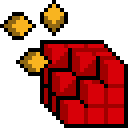
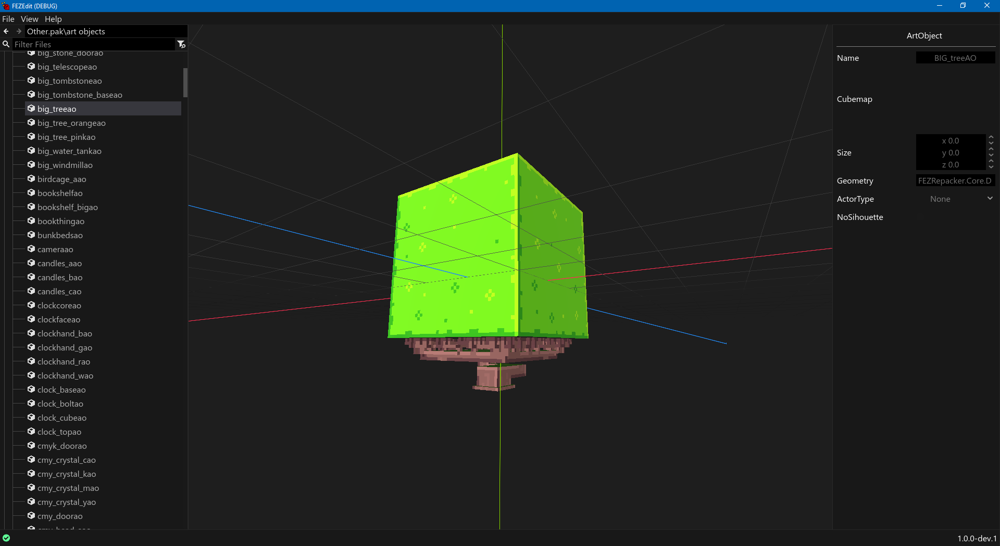
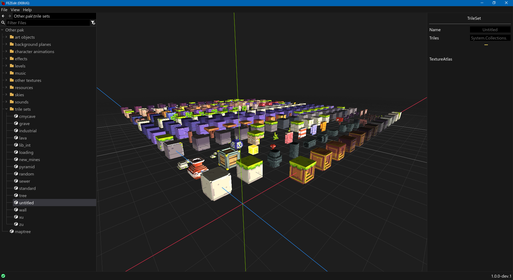
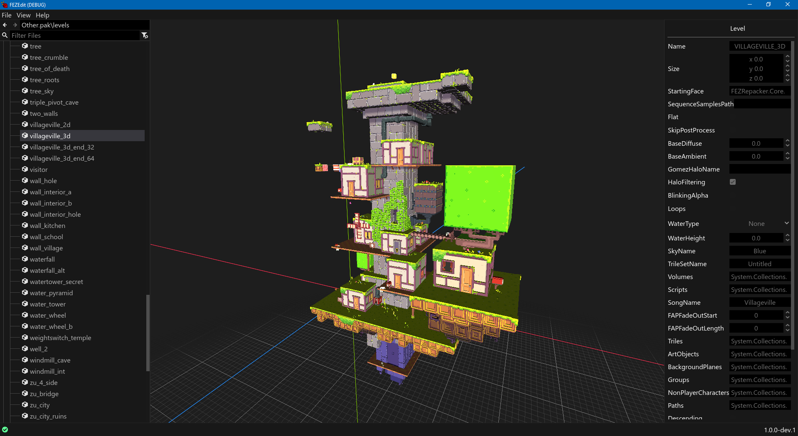
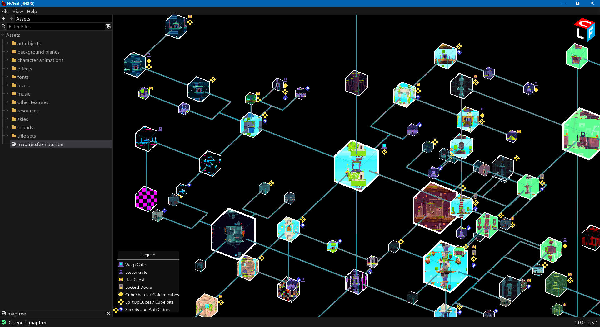
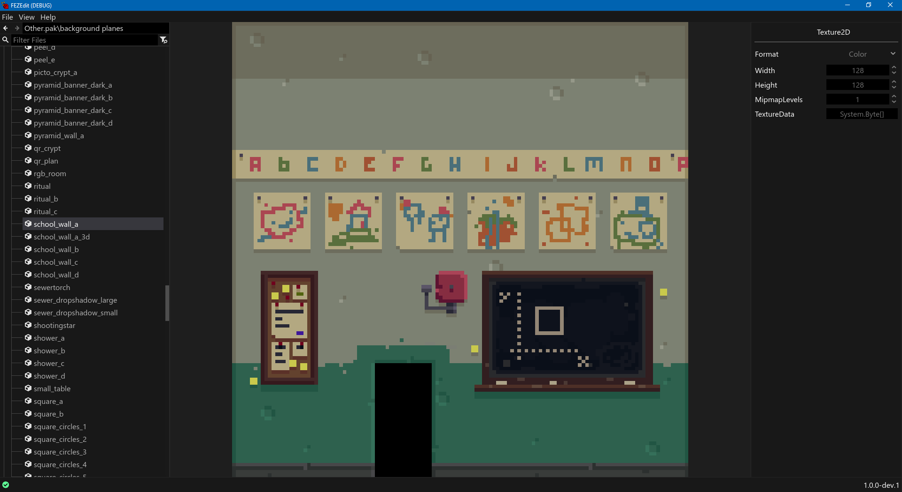
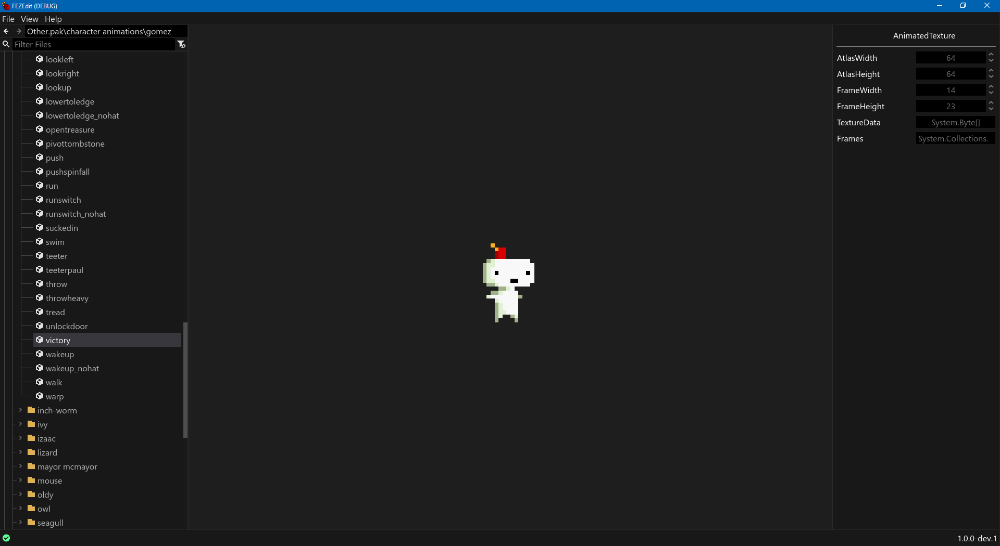

#  FEZEdit

## A Modding Tool for FEZ

<table>
  <tr>
    <td></td>
    <td></td>
    <td></td>
  </tr>
  <tr>
    <td></td>
    <td></td>
    <td></td>
  </tr>
</table>

See the [Screenshots](./Documentation/Screenshots) for more images.

## Overview

FEZEdit is a GUI tool created for managing and modding FEZ's assets.

> [!WARNING]
> FEZEdit is in a development state, and only suitable for use by modding developers.
> 
> Expect that some features will be missing or will not work at all.

## Building

> [!WARNING]
> Clone the repository with flag `--recurse-submodules`.
> 
> If you have already cloned the project, use this:
> ```
> git submodule init
> git submodule update
> ```

FEZEdit uses [Godot 4.5.1 with C# support](https://godotengine.org/download). Older versions will not work.
Before opening the `FEZEdit.sln` solution in your IDE of choice, open the `FEZEdit/project.godot` in Godot
first to import all files.

## Documentation

You can find documentation for the program in [Documentation](./Documentation) folder.

It's still a work in progress so there are some pages missing.

## Features

### Asset Management

* Opening PAK files
* Opening folders with extracted assets (XNB and FEZRepacker formats are supported)
* Converting assets from XNB and back
* Extracting assets from PAK and repacking them

### Asset Editing

* World Map
* Tracked Songs
* Static text (localization files)
* Save files (PC and iOS formats)

## Special thanks to

* [Godot contributors](https://github.com/godotengine/godot) for saving hours of headaches when creating a GUI with 3D support.
* [Krzyhau's FEZRepacker](https://github.com/FEZModding/FEZRepacker) for taking on the heavy lifting of reading and converting assets.
* [Jenna1337's FEZTools](https://github.com/Jenna1337/FezTools) for making a custom world map and save editing possible.
